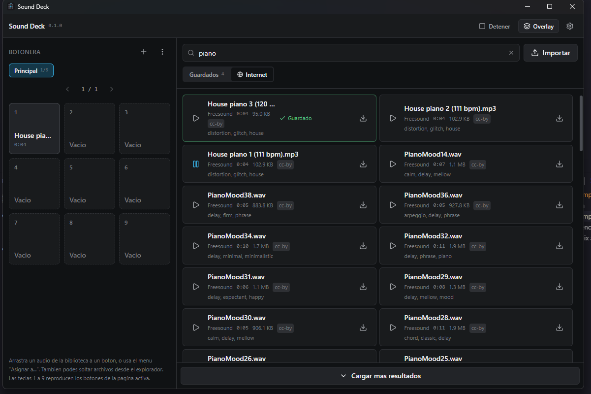

# Sound Deck

[](https://github.com/cabellonic/sound-deck/actions/workflows/ci.yml)
[](https://github.com/cabellonic/sound-deck/releases/latest)
[](LICENSE)

Soundboard de escritorio con overlay global, biblioteca local y búsqueda en proveedores online.
Local-first: tus audios viven en tu computadora y funcionan sin conexión.

- **Nueve botones por página**, disparables con las teclas `1`–`9`.
- **Overlay global** (`Alt + Inicio`) que aparece sobre juegos en ventana o borderless,
  captura la tecla, reproduce y se cierra devolviendo el foco.
- **Biblioteca local** con búsqueda instantánea, filtros automáticos y deduplicación por contenido.
- **Volumen por audio**, que se puede deslinkear del volumen general para domar
  ese audio que revienta o levantar el que se grabó bajito. Opcionalmente,
  **normalización automática** que iguala el volumen de toda la biblioteca.
- **Imagen por audio**, opcional, que la botonera y el overlay muestran en el botón.
  Se asigna arrastrando la imagen sobre el audio en la biblioteca, o desde su menú.
- **Búsqueda online** mediante proveedores conectables (Freesound incluido). Conectando
  tu cuenta de Freesound se descarga el archivo original en vez de la preview.
- **Selección de dispositivo de salida**, incluidos dispositivos virtuales como VB-Cable.
- Corre en segundo plano desde la bandeja del sistema.
- **Inicio con el sistema**, opcional: arranca directo en la bandeja al iniciar sesión,
  sin abrir la ventana.

---

## Descargar

Los instaladores están en la [última release](https://github.com/cabellonic/sound-deck/releases/latest),
compilados automáticamente para cada versión publicada.

| Sistema              | Archivo                           | Notas                                                       |
| -------------------- | --------------------------------- | ----------------------------------------------------------- |
| Windows 10/11        | `Sound.Deck_x.y.z_x64-setup.exe`  | Instalador NSIS, por usuario, sin permisos de administrador |
| Debian / Ubuntu      | `Sound.Deck_x.y.z_amd64.deb`      | `sudo apt install ./Sound.Deck_*.deb`                       |
| Otras distribuciones | `Sound.Deck_x.y.z_amd64.AppImage` | `chmod +x` y ejecutar                                       |

Los instaladores **no están firmados digitalmente**. La primera vez, Windows va a
mostrar un aviso de SmartScreen — **Más información** → **Ejecutar de todas
formas**. Si preferís no confiar en un binario sin firmar, compilalo vos mismo
con las instrucciones de más abajo: es la misma fuente.

---

## Cómo se ve



A la izquierda la botonera, con las nueve teclas de la página activa. A la
derecha la biblioteca: la pestaña **Guardados** son tus audios locales y la
pestaña **Internet** busca en los proveedores que tengas activados. Un audio se
asigna a un botón arrastrándolo, o desde el menú **Asignar a...**.

Soltar una imagen del explorador sobre un audio de la lista se la asigna como
portada. Si el audio es un resultado de Internet que todavía no descargaste,
Sound Deck te ofrece descargarlo primero.

---

## Requisitos

| Herramienta               | Versión mínima | Notas                                                             |
| ------------------------- | -------------- | ----------------------------------------------------------------- |
| Node.js                   | 20             | Probado con 22.18                                                 |
| pnpm                      | 10             | Probado con 11.6                                                  |
| Rust (estable)            | 1.87           | Probado con 1.96, toolchain `x86_64-pc-windows-msvc`              |
| WebView2 Runtime          | 110+           | Ya viene con Windows 11; en Windows 10 puede requerir instalación |
| Visual Studio Build Tools | 2019+          | Carga de trabajo "Desarrollo para escritorio con C++"             |

En Linux hacen falta además `libwebkit2gtk-4.1-dev`, `libayatana-appindicator3-dev`,
`librsvg2-dev`, `libasound2-dev` y `build-essential`.

---

## Instalación y desarrollo

```bash
pnpm install
pnpm app:dev      # levanta Vite + la aplicación Tauri con recarga en caliente
```

La primera compilación de Rust tarda varios minutos porque construye todo el árbol
de dependencias, incluidos SQLite (embebido) y WebView2.

### Comandos disponibles

| Comando                             | Qué hace                                                   |
| ----------------------------------- | ---------------------------------------------------------- |
| `pnpm app:dev`                      | Aplicación completa en modo desarrollo                     |
| `pnpm dev`                          | Solo el frontend en el navegador (los comandos IPC fallan) |
| `pnpm build`                        | Typecheck + bundle del frontend                            |
| `pnpm app:build`                    | Instalador completo (NSIS en Windows)                      |
| `pnpm build:linux`                  | Paquete `.deb` de Linux, compilado dentro de WSL           |
| `pnpm typecheck`                    | `tsc --noEmit`                                             |
| `pnpm lint` / `pnpm lint:fix`       | ESLint                                                     |
| `pnpm format` / `pnpm format:check` | Prettier                                                   |
| `pnpm test` / `pnpm test:watch`     | Vitest                                                     |
| `pnpm rs:fmt`                       | `cargo fmt`                                                |
| `pnpm rs:lint`                      | `cargo clippy -D warnings`                                 |
| `pnpm rs:test`                      | Tests unitarios y de integración de Rust                   |
| `pnpm check:all`                    | Todo lo anterior, en orden                                 |

### Compilar el instalador

```bash
pnpm app:build
```

El resultado queda en `src-tauri/target/release/bundle/`. En Windows se genera un
instalador NSIS que se instala por usuario (no requiere permisos de administrador).

Para obtener solo el ejecutable, sin instalador:

```bash
pnpm tauri build --no-bundle
# -> src-tauri/target/release/sound-deck.exe
```

### Compilar el paquete de Linux desde Windows

```bash
pnpm build:linux
```

Compila el `.deb` y el binario de Linux dentro de WSL, sin necesidad de Docker
ni de un servidor remoto, y deja todo en `dist-linux/` junto al `.exe` de
Windows. La primera corrida instala la toolchain dentro de la distro (Rust,
Node 22, pnpm y las dependencias de sistema de Tauri) y tarda varios minutos;
las siguientes reutilizan esa instalación, el caché de cargo y los
`node_modules`, que viven del lado de WSL.

El código se copia al sistema de archivos nativo de la distro antes de
compilar. Hacerlo directamente sobre `/mnt/c` funciona, pero es varias veces
más lento: cada acceso a un archivo cruza el puente hacia NTFS.

| Opción              | Para qué                                                  |
| ------------------- | --------------------------------------------------------- |
| `-Distro <nombre>`  | Usar una distro concreta en vez de la predeterminada      |
| `-LinuxOnly`        | Generar solo los artefactos de Linux, sin tocar el `.exe` |
| `-SkipWindowsBuild` | Reutilizar el `.exe` que ya esté en `target/release`      |

```powershell
powershell -File scripts/build-linux.ps1 -Distro Ubuntu-24.04 -LinuxOnly
```

Requiere WSL 2 con una distro Ubuntu o Debian que todavía empaquete
`libwebkit2gtk-4.1-dev`, que es contra lo que se compila Tauri 2. Si falta, el
script lo dice antes de empezar a compilar en vez de fallar dentro de cargo.

---

## Estructura

```text
src/                          Frontend (React + TypeScript)
├── components/
│   ├── library/              Biblioteca: filtros, filas locales y remotas, lista virtualizada
│   ├── settings/             Pantalla de configuración
│   ├── soundboard/           Botonera 3×3 y barra de páginas
│   └── ui/                   Primitivas sobre Radix + toasts + diálogos
├── features/                 Hooks: consultas, mutaciones, eventos, atajos, tema
├── lib/                      Capa IPC tipada, eventos, drag and drop, utilidades
├── i18n/                     Catálogo de textos y hook de traducción
├── stores/                   Zustand (solo estado de interfaz)
├── types/                    Tipos de dominio, espejo de los structs de Rust
├── windows/main/             Ventana principal
├── windows/overlay/          Overlay compacto
└── tests/                    Vitest + Testing Library

src-tauri/
├── migrations/               SQL de migraciones, embebido en el binario
├── capabilities/             Permisos de Tauri 2, por ventana
├── installer-hooks.nsh       Limpieza del registro al desinstalar (NSIS)
└── src/
    ├── audio/                Dispositivos (cpal), reproducción (rodio) y sonoridad
    ├── autostart.rs          Inicio con el sistema y arranque oculto en bandeja
    ├── commands/             Comandos expuestos al frontend
    ├── database/             Conexión, migraciones y repositorios
    ├── domain/               Tipos de dominio y reglas puras
    ├── downloads/            Descarga con límites + validación de URL
    ├── errors/               Errores de dominio serializables
    ├── events/               Eventos hacia el frontend
    ├── filesystem/           Rutas administradas y validación de audio
    ├── library/              Única puerta de entrada de audios a la biblioteca
    ├── overlay/              Control de la ventana overlay
    ├── platform/             Código específico por sistema operativo (Win32 aislado)
    ├── providers/            Trait `SoundProvider`, Freesound y OAuth2
    ├── shortcuts/            Normalización, validación y registro de atajos
    ├── state/                Estado compartido
    └── tray/                 Bandeja del sistema
```

### Dónde se guardan los datos

```text
%APPDATA%\app.sounddeck.desktop\      (Windows)
~/.local/share/app.sounddeck.desktop/ (Linux)
├── database.sqlite
├── sounds/        <uuid>.<ext>  — los audios administrados
├── images/        <uuid>.<ext>  — las imágenes de los audios
├── temp/          descargas e importaciones en curso
├── logs/          sound-deck.YYYY-MM-DD.log (rotación diaria, 7 días)
└── backups/       copias manuales de la base
```

La base de datos **nunca** guarda binarios de audio: solo metadata y la ruta al archivo.

---

## Proveedores online

Todos vienen **desactivados**. Se activan uno por uno en **Ajustes → Proveedores**,
donde cada uno explica qué necesita.

### Freesound (oficial)

Banco de sonidos y efectos con licencias declaradas. No es un sitio de memes.

1. Creá una cuenta en [freesound.org](https://freesound.org) y entrá a
   [freesound.org/apiv2/apply](https://freesound.org/apiv2/apply/).
2. Completá **solo el nombre y la descripción** de la aplicación.
3. El formulario también pide una **URL de callback**. Es únicamente para OAuth2:
   Sound Deck usa autenticación por token, así que ese campo no se usa. Podés dejarlo
   vacío o poner cualquier dirección. Si el sitio te obliga a completarlo, Freesound
   acepta que uses su propia URL como destino de redirección.
4. La clave aparece al instante en la tabla de credenciales. Copiá el **API key**
   (no el client secret) y pegalo en Ajustes.

La clave se guarda solo en tu base local, nunca aparece en los logs y la interfaz la
muestra enmascarada después de guardarla.

**Alcance:** la API con token entrega la búsqueda y las previsualizaciones en alta
calidad (MP3), que es lo que Sound Deck descarga y guarda, bajo la misma licencia del
sonido original. Descargar el archivo original sin comprimir requiere OAuth2 con
consentimiento del usuario, que queda fuera de esta versión. La arquitectura ya lo
contempla: solo cambia `resolve_download`.

### MyInstants (no oficial)

Es la fuente con más memes y audios de la comunidad, incluida una sección grande de
Argentina y Latinoamérica. **No tiene API pública**, así que Sound Deck lee las mismas
páginas públicas de búsqueda que verías en un navegador. No hace falta ninguna clave:
alcanza con activarlo.

Antes de implementarlo se revisaron sus restricciones públicas:

- Su `robots.txt` declara `Allow: /` para el user-agent genérico `*`, y solo bloquea
  rutas puntuales (`/add/`, `/report/`, `/analytics/`, `/gifs/`, `/image/`, `/beyond/`,
  `/facebook/`) más una lista de crawlers de entrenamiento de IA. `/search/` no está
  restringido y Sound Deck se identifica con su propio User-Agent.

Lo que el código respeta, y no solo la documentación:

- **Solo bajo demanda:** una consulta por búsqueda que hagas vos. No hay crawler, ni
  recorrido del catálogo, ni descarga masiva.
- **Límite propio de frecuencia:** nunca más de una petición cada 1,2 s.
- **Sin evasión:** no toca rutas prohibidas, no falsifica el User-Agent, no resuelve
  CAPTCHAs ni salta autenticación.
- **Aislado:** si el HTML cambia, falla solo este proveedor con un mensaje claro y el
  resto de la aplicación sigue andando. El modelo de datos no depende de ese HTML.

**Dos advertencias importantes.** Al no haber API oficial, el proveedor puede dejar de
funcionar sin aviso si el sitio se rediseña. Y los audios los sube la comunidad **sin
declarar licencia**: Sound Deck guarda el enlace de origen en la metadata, pero revisar
qué podés hacer con cada audio queda de tu lado, sobre todo si lo usás en algo público.

### Privacidad de las búsquedas

Cada búsqueda envía únicamente el texto que escribís, y solo a los proveedores que
tengas activados. Sound Deck no manda tu biblioteca ni los nombres de tus archivos.

---

## Enviar el audio a Discord, OBS o un juego

**Sound Deck no crea un micrófono virtual ni instala drivers.** Solo reproduce en el
dispositivo de salida que elijas. Para que otra aplicación escuche esos sonidos
necesitás un dispositivo virtual ya instalado en el sistema (VB-Cable, VoiceMeeter,
Virtual Audio Cable o el equivalente de tu distribución en Linux).

```text
Parlantes normales
  Sound Deck ──► Parlantes / auriculares

Discord y juegos
  Sound Deck ──► Salida virtual (ej. "CABLE Input")
                          │
                          ▼
  Discord: micrófono = entrada virtual (ej. "CABLE Output")

OBS
  Sound Deck ──► Salida virtual
  OBS: "Captura de entrada de audio" ──► entrada virtual
```

Los pasos concretos:

1. Instalá el dispositivo virtual y reiniciá.
2. En **Ajustes → Audio**, elegí la salida virtual (`CABLE Input` o similar).
3. Usá **Probar** para confirmar que la aplicación abre ese dispositivo.
4. En Discord, poné como micrófono la entrada correspondiente (`CABLE Output`).
5. Si también querés escucharte, activá el "listen"/monitor del dispositivo virtual
   en la configuración de sonido de Windows.

---

## Limitaciones conocidas

- **Fullscreen exclusivo:** el overlay puede no mostrarse sobre juegos en fullscreen
  exclusivo. Funciona en ventana y en borderless fullscreen. Es una limitación del
  compositor, no del programa.
- **Restaurar el foco:** solo está implementado en Windows (`SetForegroundWindow`).
  Windows puede rechazar legítimamente el cambio de foco; en ese caso el overlay se
  cierra igual pero el foco no vuelve solo. En Linux y macOS lo maneja el gestor de
  ventanas.
- **Sin micrófono virtual propio:** ver la sección anterior.
- **Proveedores no oficiales:** MyInstants depende del HTML del sitio. Puede dejar de
  funcionar sin aviso si lo rediseñan, y sus audios no declaran licencia.
- **Normalización sin limitador:** la ganancia se limita para que el pico no sature,
  pero no hay un limitador que comprima picos aislados. Un audio con un pico muy por
  encima de su volumen medio se va a normalizar menos de lo ideal.
- **Reproducción global de `1`–`9`:** desactivada por defecto. Al activarla toma nueve
  combinaciones en todo el sistema, que quedan fuera del alcance de otros programas.

---

## Solución de problemas

**No se escucha nada.**
Ajustes → Audio → **Probar**. Si el tono no suena, el dispositivo elegido no está
funcionando: probá con "Predeterminado del sistema" y actualizá la lista con el botón
de recarga.

**El dispositivo virtual no aparece.**
Instalalo y reiniciá el equipo; después usá **Actualizar dispositivos**. Sound Deck
solo lista lo que el sistema le informa.

**El overlay no aparece sobre el juego.**
Poné el juego en modo ventana o borderless. En fullscreen exclusivo ninguna ventana
superpuesta funciona de forma confiable.

**La tecla llega igual al juego.**
Eso significa que el overlay no tomó el foco. Comprobá que la ventana del overlay se
vea al frente. Sound Deck no instala hooks de teclado globales a propósito: la única
razón por la que la tecla no se propaga es que el overlay tiene el foco.

**El atajo global no se registra.**
Otra aplicación ya lo está usando. Ajustes → Atajos te avisa cuál falló; elegí otra
combinación. El atajo anterior se conserva si el nuevo no pudo registrarse.

**"El archivo de audio ya no está en la carpeta de la aplicación".**
Alguien borró o movió el archivo administrado. Ajustes → Biblioteca →
**Eliminar registros huérfanos** limpia esos registros y libera los botones.

**La búsqueda online no devuelve nada.**
Verificá que el proveedor esté activado y con API key válida (**Probar conexión**).
Si el proveedor falla, el error se muestra arriba de la lista y el resto de la
aplicación sigue funcionando normalmente.

**Activé "Iniciar con el sistema" y al reiniciar no aparece nada.**
Es lo esperado: arranca oculto en la bandeja, junto al reloj. El ícono de Sound Deck
abre la ventana con un clic. Si el ícono tampoco está, revisá que el arranque siga
activo (en Windows, Administrador de tareas → **Inicio**): Sound Deck respeta lo que
digas ahí y actualiza el interruptor de Ajustes en el próximo arranque.

**Activé el inicio automático en modo desarrollo.**
Lo que queda registrado es el ejecutable de `target/debug`, que puede no existir
después. Desactivalo desde Ajustes antes de borrar la carpeta de compilación.

**Activé "Igualar el volumen" y no cambió nada.**
Solo se miden los audios al importarlos. Los que ya estaban necesitan una pasada:
Ajustes → Audio → **Medir**. Los que no se puedan medir siguen sonando como antes.

**El atajo del overlay sigue siendo el viejo.**
Si venís de una versión anterior, tus atajos guardados se migran a `Alt + Inicio` y
`Alt + Fin` solo si nunca los cambiaste. Si elegiste los tuyos, se respetan.

**Quiero bajar el archivo original de Freesound, no la preview.**
Ajustes → Proveedores → Freesound. Además de la API key, pegá el **Client id** y
apretá **Autorizar en Freesound**: se abre el navegador, autorizás y pegás el código
que te muestra. Para que Freesound te muestre el código en pantalla, tu credencial
tiene que estar configurada con esa opción de callback.

**Los logs.**
Ajustes → Avanzado → **Abrir carpeta de logs**. Para más detalle sin recompilar:
`SOUND_DECK_LOG=debug` antes de iniciar la aplicación.

---

## Privacidad

Sound Deck es local-first. Por defecto:

- no envía telemetría ni usa analytics;
- no sube tu biblioteca ni los nombres de tus archivos;
- no requiere cuenta ni servidor propio;
- no guarda cookies ni credenciales de los proveedores.

La única salida a Internet ocurre cuando vos buscás en la pestaña **Internet** o
descargás un audio. En ese caso se envía el texto de la búsqueda al proveedor que
tengas activado, y la descarga se hace directamente contra sus servidores.

---

## Licencias

El código de Sound Deck está bajo licencia MIT (ver `LICENSE`).

El repositorio **no incluye ningún audio de terceros**. La prueba de dispositivo usa
un tono senoidal generado en memoria. Los audios que descargues conservan su licencia
original: Sound Deck guarda el código de licencia y la atribución en la metadata de
cada sonido, visible desde "Ver metadata". Respetar esas licencias al usar o compartir
los audios es responsabilidad de quien los usa.

Las dependencias de terceros y sus licencias están en `THIRD-PARTY.md`.

---

## Roadmap

Implementado y verificado en esta versión:

- Persistencia SQLite con migraciones, páginas, slots y configuración.
- Importación local con validación por contenido, hash y deduplicación.
- Motor de audio con selección de dispositivo, modos interrupt/overlap y volúmenes.
- Volumen propio y absoluto por audio y por botón: `botón ?? audio ?? general`.
- Imagen opcional por audio, visible en la botonera y en el overlay, asignable
  arrastrando el archivo sobre el audio en la biblioteca.
- Botonera con drag and drop, intercambio de slots y teclas `1`–`9`.
- Overlay con atajo global, captura de teclas, cierre automático y restauración de foco.
- Configuración completa en seis secciones.
- Bandeja del sistema: cerrar y minimizar ocultan la ventana, e inicio automático con
  la sesión que arranca directo en la bandeja.
- Proveedores Freesound (oficial) y MyInstants (no oficial), con búsqueda,
  previsualización, descarga validada y asignación.

- Restaurar una copia de seguridad, con validación previa y reinicio automático.
- Reproducción global de `1`–`9` sin abrir el overlay, con modificador configurable.
- Posición del overlay elegible arrastrándolo, además del centrado automático.
- Normalización de volumen por medición EBU R128, con techo anticlipping.

- OAuth2 en Freesound para descargar el archivo original en vez de la preview.
- Toda la interfaz traducida desde un catálogo con claves tipadas: agregar un idioma
  no toca ningún componente.

Pendiente:

- Un segundo idioma. La infraestructura está y toda la interfaz sale del catálogo;
  falta escribir un `src/i18n/<idioma>.ts` con las mismas claves.

Fuera de alcance por decisión de diseño: micrófono virtual propio, driver de audio,
sincronización cloud, cuentas, clasificación con IA, inyección en procesos y hooks de
teclado invasivos.

---

## Contribuir

Ver `CONTRIBUTING.md`.
